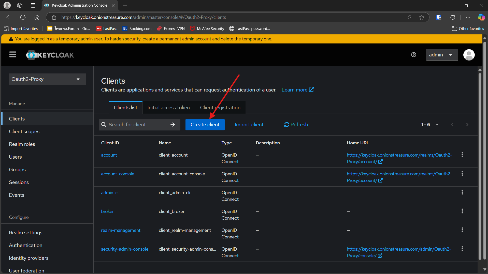

# Oauth2-Proxy-Keycloak-authentication
## Install longhorn 
- install with raw manifest file
```bash
kubectl apply -f https://raw.githubusercontent.com/longhorn/longhorn/v1.8.1/deploy/longhorn.yaml
```
- or install with helm
```bash
helm repo add longhorn https://charts.longhorn.io
helm repo update
helm install longhorn longhorn/longhorn --namespace longhorn-system --create-namespace --version 1.8.1
```

## Install nginx
- install with manifest file raw 
```bash
kubectl apply -f https://raw.githubusercontent.com/kubernetes/ingress-nginx/controller-v1.12.1/deploy/static/provider/cloud/deploy.yaml
```

- or install with helm (optional)
```bash
helm repo add ingress-nginx https://kubernetes.github.io/ingress-nginx

helm repo update
helm install ingress-nginx ingress-nginx/ingress-nginx /
  --namespace <ingress-nginx> /
  --create-namespace
```

## Install cert-manager
```bash
kubectl apply -f https://github.com/cert-manager/cert-manager/releases/download/v1.14.4/cert-manager.yaml
```
- Change a ClusterIssuer.yaml

This tells Cert-Manager how to request certificates. Use a ClusterIssuer for cluster-wide access, or Issuer for namespace-specific.
```bash
email: youremail@email.com
    privateKeySecretRef:
      name: <<your-key-ref>>
```
Apply clusterIssuer
```bash
kubectl apply -f cluster-issuer.yaml
```


## Deploy Keycloak

Create a keycloak.yaml manifest that includes:

- Deployment

- Service

- Ingress

Apply the Keycloak configuration:

```bash
kubectl apply -f keycloak.yaml
```

Change keycloak ingress file to your domain that you use
```bash
host: <<your-domain>>
```

Apply ingress 
```bash
kubectl apply -f keycloak_ingress.yaml
```


## Set up config and deploy quickwit
- Modify the pvc-quickwit.yaml file:
```bash
storageClassName: longhorn
```
- Deploy Quickwit with quickwit.yaml which includes:

  - PVC

  - Deployment

  - Service

```bash
kubectl apply -f pvc-quickwit.yaml
kubectl apply -f quickwit.yaml
```


Change quickwit and longhorn ingress file to your domain that you use
```bash
host: <<your-domain>>
```
Apply file longhorn and quickwit ingress
```bash
kubectl apply -f ingress_longhorn.yaml
kubectl apply -f ingress_quickwit.yaml
```

## Set up realm cliend and user
Access keycloak by : 

- **forward port**
```bash
kubectl port-forward svc/keycloak 8080:8080
```
- **Ingress**: Use the domain you configured (e.g., https://keycloak.example.com)


Login Keycloak with username and password that setting in deployment

**Once inside Keycloak:**

- Create a new Realm


- Create a new Client with:

  - Access Type: confidential

  - Redirect URI: the domain where OAuth2 Proxy is running (e.g., https://app.example.com/oauth2/callback)





![Keycloak Create ]

- Create a test User

## Get credential of clienId

**In Keycloak:**

- Navigate to Clients > [Your Client] > Credentials

- Note the Client ID and Client Secret

These will be needed to configure OAuth2 Proxy.


## Set config oauth2-proxy
Change values of oauth2_config.yaml to your domain URL and generate your Cookie Secret

```yaml
apiVersion: v1
data:
  oauth2-proxy.cfg: |-
    # Provider config
    provider="keycloak"
    provider_display_name="Keycloak"
    login_url="https://<keycloak-domain>/realms/<Realm Name>/protocol/openid-connect/auth"
    redeem_url="https://<keycloak-domain>/realms/<Realm Name>/protocol/openid-connect/token"
    validate_url="https://<keycloak-domain>/realms/<Realm Name>/protocol/openid-connect/userinfo"
    profile_url="https://<keycloak-domain>/realms/<Realm Name>/protocol/openid-connect/userinfo"
    ssl_insecure_skip_verify=false

    # Client config
    client_id="<Client ID>"
    client_secret="<Client Secret>"
    cookie_secret="<Cookie Secret>"
    cookie_secure="true"
    
    # Upstream config
    http_address="0.0.0.0:4180"
    upstreams="file:///dev/null"
    email_domains=["*"]
    oidc_issuer_url="https://<domain>/realms/<Realm Name>"
    cookie_domains=["quickwit.domain.com", "longhorn.example.com"]
    scope="openid"
    whitelist_domains=[".quickwit.domain.com:*", ".longhorn.example.com:*"]
    session_store_type="redis"
    redis_connection_url="redis://redis-service.oauth2-proxy.svc.cluster.local:6379"

kind: ConfigMap
metadata:
  name: oauth2-proxy-config
  namespace: oauth2-proxy
```


you can generate you secret with 
```bash
python -c "import os, base64; print(base64.b64encode(os.urandom(32)).decode())"
```
and then change cookie secret

```bash
cookie_secret="<<your-secret>>"
```

Apply the oauth configuration:

```bash
kubectl apply -f oauth2_config.yaml
```
## Deploy Oauth2-proxy
Create a deployment manifest oauth2-proxy.yaml

including:

- Deployment

- Service

- Ingress (use the same domain as your protected app)

ingress file need to have annotation
```bash
nginx.ingress.kubernetes.io/auth-url: "https://<your-oauth2-domain>/oauth2/auth"
nginx.ingress.kubernetes.io/auth-signin: "https://<your-oauth2-domain>/oauth2/start?rd=$request_uri"
```
Apply the oauth2 proxy:
```bash
kubectl apply -f oauth2-proxy.yaml
```

## Testing

### Longhorn

access the longhorn domain you configured (e.g., https://longhorn.example.com) to testing redirect and authetication


### Quickwit

access the Quickwit domain you configured (e.g., https://quickwit.example.com) to testing redirect and authetication


## Credits
Configuration and flow adapted from
🔗 [Ibrahim H. Koyuncu's Medium article](https://ibrahimhkoyuncu.medium.com/kubernetes-ingress-external-authentication-with-oauth2-proxy-and-keycloak-9924a3b2d34a)